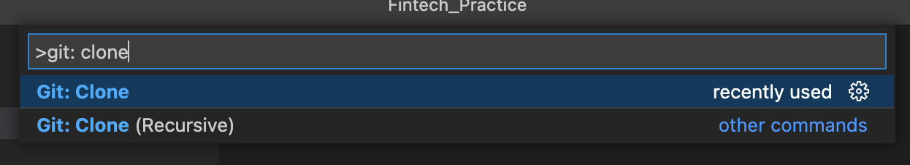
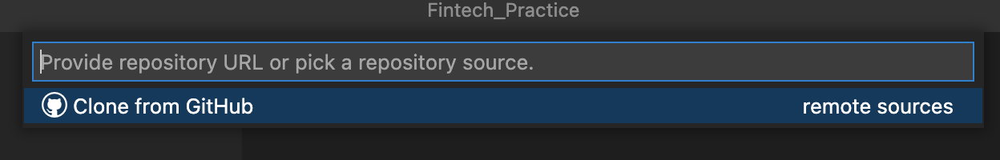
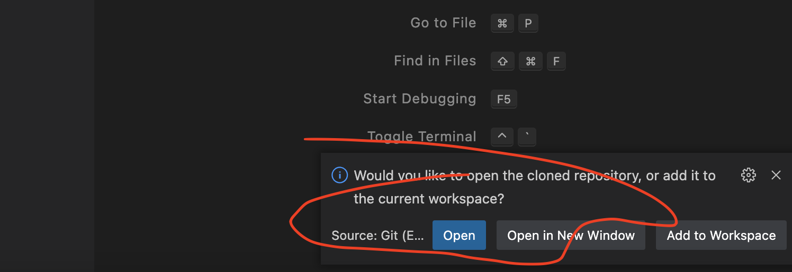
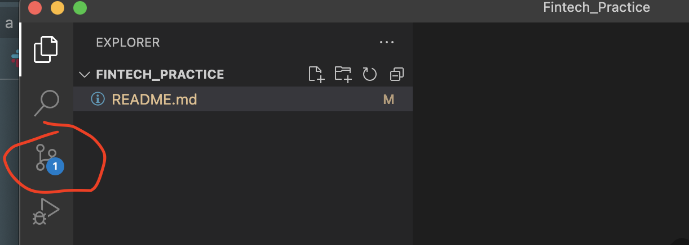
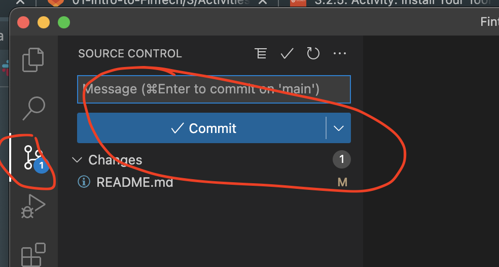
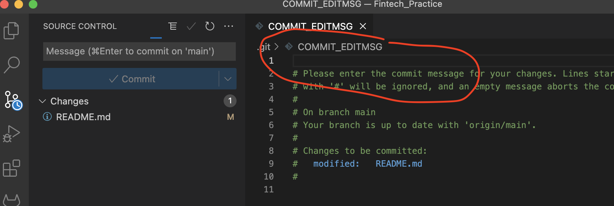
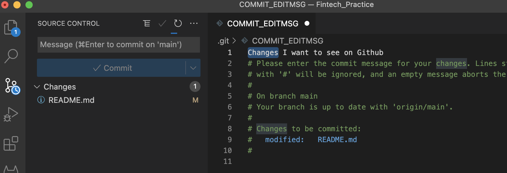
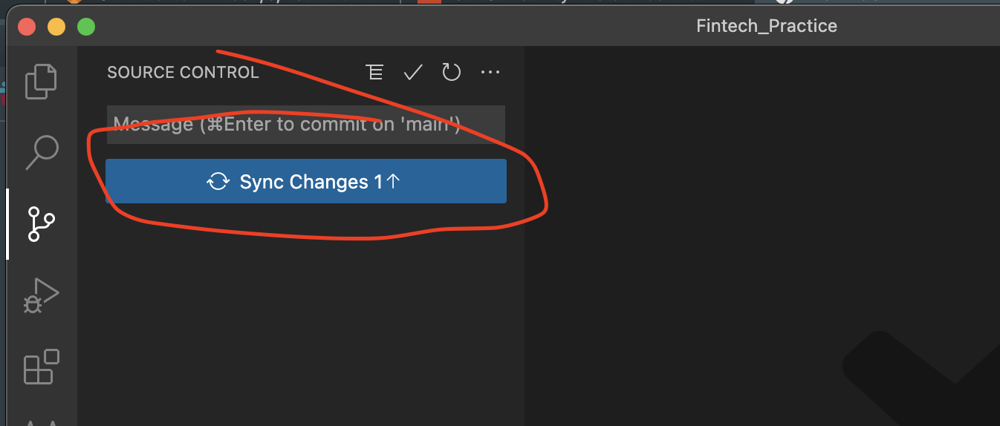

# Approach 3 - Use VSCode to do git interactions with GitHub. 

## Step 1 - git clone
* Open command palette on VSCODE (SHIFT+COMMAND+P for Mac Users, SHIFT+CONTROL+P for Window users).
* Type ```git: clone``` and press enter
* You will be asked to provide a URL which is the HTTPS address of your GitHub repo. Copy and paste your HTTPS address in. \





<br/>

---

<br/>

## Step 2 - edit README on VSCode
* Select a folder that you want to download your repo to. Open the repo and make some changes to your README file. Save the changes. \




<br/>
<br/>
<br/>

---


<br/>

## Step 3 - push to GitHub

* Now you want to push those changes to GitHub. Move over to Source Control (the third icon on the left panel of your VScode), click commit. 




<br/>
<br/>
<br/>


<br/>
<br/>
<br/>

* You will then be asked to write your commit message on the editing section of your vscode. Save your message and close the message file. Click Sync changes. Now you just successfully pushed your changes to GitHub. Check it out on GitHub by yourself.  



<br/>
<br/>
<br/>

<br/>
<br/>
<br/>




<br/>
<br/>
<br/>

* You may have noticed that VSCode allows to do git operations without writing those commands. This is why a lot of people use IDE to improve productivity. If you want to do git pull, you can navigate to ‘Source Control’ and find that feature. You may explore this by yourself. There are also more advanced git functions that VSCode accommodate. For example, git checkout, git merge, pull request etc. I will leave you to Google search that.


--- 
<br/>
<br/>
<br/>

## Last but not least - You may want to download and open this markdown instructions on your VScode and have a read of the codes I used to insert images if you are not sure how to do that. See you next time - enjoy learning!


